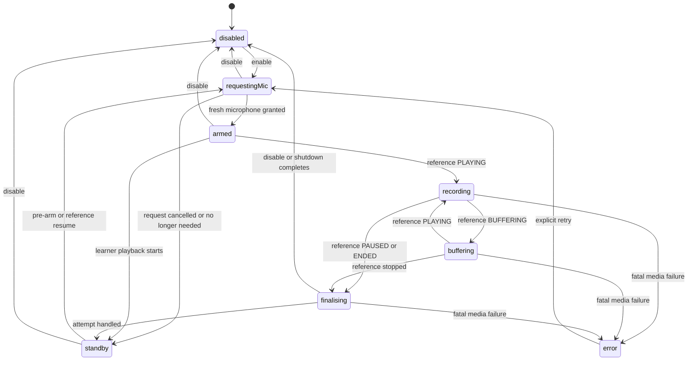

# Microphone and Playback Lifecycle

The player-driven recording and microphone pre-arming rules below describe the
**Shadowing** style. The additional **Listen first** style uses explicit
recording with the reference paused and keeps its microphone off during both
playback steps; its phase policy and acceptance details are defined in
[Listen first practice](listen-first-practice.md). Shared identity, generation,
finalisation, stream cleanup, and privacy invariants apply to both styles.

Status: Implemented subsystem design

Last updated: 2026-07-12

This document is the focused design source for coordinating Practice Mode,
microphone ownership, YouTube reference playback, and learner-recording
playback. The broader
[technical design](shadowing-recorder-technical-design.md) owns the complete MVP
runtime, while the
[MVP requirements](../requirements/shadowing-recorder-mvp.md) own acceptance.

## Goals and invariants

The lifecycle must preserve all of these properties:

1. Recording starts only for the currently validated player while Practice
   Mode is explicitly enabled.
2. App-initiated reference playback and learner-recording playback never remain
   audible together.
3. Learner-recording playback never overlaps an active `MediaRecorder`.
4. A microphone stream that backed a completed recorder is never reused for a
   later attempt.
5. A pre-armed microphone stream is released before learner playback starts and
   reacquired only after learner playback pauses or ends.
6. Every intentional shutdown stops every track, even if stopping one track
   throws.
7. Late permission, recorder, player, and track callbacks cannot mutate a newer
   lifecycle generation.
8. Completed audio remains a session-local Blob URL. No lifecycle event adds a
   network path for learner audio, diagnostics, player activity, or consent.

The fourth and fifth rules are deliberate iOS Safari compatibility boundaries,
not optional optimisations.

## Ownership boundaries

| Owner | Responsibility |
| --- | --- |
| `RecorderController` | Practice Mode state, microphone requests and tracks, recorder attempts, finalisation, generations, player-binding validation, and the latest completed Blob URL. |
| `recorderMachine` | The mutually exclusive controller state and legal transitions. It does not own browser resources. |
| `RecorderSpike` | UI intent, learner `<audio>` playback, app Reference controls, `Space` / `Right Arrow`, and ordering learner-audio shutdown before controller reference handling. |
| YouTube adapter | Native IFrame API construction and normalized player callbacks. It never owns microphone state. |
| Browser adapters | `getUserMedia`, `MediaRecorder`, object URLs, MIME capability checks, and clocks behind injectable interfaces. |

The controller is the only owner allowed to retain or stop microphone tracks.
React effects and media-element handlers express intent through the controller;
they do not manage a stream directly.

## Controller states

| State | Practice Mode | Microphone | Recorder | Meaning |
| --- | --- | --- | --- | --- |
| `disabled` | Off | No request or live track | None | Player events cannot start capture. |
| `requestingMic` | On | `getUserMedia()` pending | None | Initial permission, pre-arm, or reference-resume acquisition is pending. |
| `standby` | On | No request or live track | None | Safe between-attempt state; learner playback may run. |
| `armed` | On | Fresh stream live | None | Ready to start immediately when the reference plays. |
| `recording` | On | Stream live | Gathering data | YouTube is playing and the active attempt owns the recorder. |
| `buffering` | On | Stream live | Paused | The same attempt remains open without gathering buffered time. |
| `finalising` | On or closing | Stream live until completion | Stop requested | Awaiting final data and `stop`, bounded by the five-second watchdog. |
| `error` | Off | No request or live track | None | A fatal media failure stopped Practice Mode; explicit retry is available. |

`armed` and `standby` both display a ready message, but their microphone
indicators differ. `armed` means a real track is live; `standby` means the
microphone is off.

## Core lifecycle

### Enable Practice Mode

1. Stop learner playback.
2. Revalidate the immutable player binding and expected video ID.
3. Advance the lifecycle generation and enter `requestingMic`.
4. Request the microphone with optional voice processing explicitly disabled.
5. After permission resolves, revalidate generation, player identity, and
   current player state.
6. Stop every returned track if the request became stale or was cancelled.
7. Otherwise retain the stream, watch its tracks, publish applied non-identifying
   settings, and enter `armed`.
8. If YouTube is already playing, create the attempt and start recording
   immediately. No second `PLAYING` callback is assumed.

### Reference play, buffer, pause, or end

On every YouTube `PLAYING` callback, the UI stops and resets learner playback
before calling the controller. The controller then:

- starts a new recorder from `armed`;
- resumes the same recorder from `buffering`; or
- requests a fresh stream from `standby`, requiring YouTube still to be
  playing when permission resolves.

On `BUFFERING`, the controller pauses the active recorder and retains the same
attempt. On `PAUSED` or `ENDED`, it requests finalisation exactly once.

### Finalise an attempt

`MediaRecorder.stop()` is only a request boundary. The browser normally emits
the final `dataavailable` event and then `stop`. The attempt retains exclusive
ownership of its listeners, chunks, byte count, and watchdog throughout this
asynchronous interval.

After `stop`:

- A non-empty Blob becomes the latest recording. The previous object URL is
  revoked only after the replacement URL is created successfully.
- A zero-byte Blob is a non-fatal empty attempt. Nothing is saved, the previous
  playable result is preserved, and a visible explanation is shown.
- In both cases, every track from the completed attempt is stopped and Practice
  Mode enters `standby` unless an explicit disable or shutdown targets
  `disabled`.
- If the reference resumed during finalisation and is still playing, the
  controller requests a fresh stream and begins a new attempt only after that
  request resolves.

The finalisation watchdog, recorder errors, and unexpected track endings remain
fatal because their result boundaries are not trustworthy.

## Switching playback sources

### Start learner-recording playback

Before the `<audio>` element is allowed to play:

1. Revalidate the current player binding.
2. Cancel a pending microphone request or stop a pre-armed stream.
3. Advance the generation and enter `standby`.
4. Ask YouTube to pause.
5. Start learner playback.

The native `<audio>` `play` event repeats the controller preparation so direct
use of the full audio controls receives the same safety behavior as the compact
comparison controls.

### Learner playback pauses or ends

If the reference is stopped, learner `pause` or `ended` pre-arms the next fresh
microphone stream. This performs the iOS audio-session transition while neither
audio source is playing. If learner playback starts again, that request is
cancelled or its returned live stream is stopped before audio continues.

### Start reference playback from app controls

The app Reference and restart controls:

1. Stop learner playback.
2. Revalidate the player binding.
3. Await an in-flight pre-arm request, or request a fresh stream from
   `standby`.
4. Revalidate the binding again after the asynchronous request.
5. Call `playVideo()` only if the playback-request token is still current.

Restart additionally seeks to zero immediately before calling `playVideo()`.
A newer playback intent invalidates the token so a late microphone result
cannot start an obsolete reference action.

### Start reference playback from native YouTube controls

The application cannot intercept the click inside the cross-origin iframe.
Instead, learner pause/end normally prepares an `armed` stream before the
native control is used. When the IFrame API reports `PLAYING`, learner audio is
stopped first and the controller starts immediately from `armed`.

If the user resumes the native player before pre-arming finishes, the pending
request reconciles the current player state after it resolves. This can leave a
small unrecorded gap, but it cannot reuse an old stream or mix learner playback
into the new attempt.

### `Space` / `Right Arrow`

Unmodified Space or Right Arrow cycles when focus is outside editable or interactive controls.
Ignore key repeats, composition, and already-handled events; preserve native
key behavior on controls. A handled cycle prevents page scrolling.

The shortcut follows the same source-specific preparation paths. If reference
capture is still finalising, it records a pending learner-playback intent and
waits for a usable completed Blob. It does not bypass finalisation or microphone
ownership.

## Generation and callback guards

Advance the controller generation when Practice Mode is enabled, cancelled,
disabled, refreshed, or superseded. Each microphone request and recorder
attempt captures its owning generation.

A returned stream is accepted only when all of these remain true:

- the controller is not disposed;
- Practice Mode is enabled;
- the captured generation is current;
- state is still `requestingMic`;
- the immutable player binding is still current and valid; and
- a reference-triggered request still observes `PLAYING` when required.

Otherwise every returned track is stopped. Recorder callbacks additionally
close over the exact attempt object, so late data cannot be appended to a newer
attempt.

## Failure and recovery matrix

| Condition | Result handling | Track handling | Next state |
| --- | --- | --- | --- |
| Non-empty final Blob | Replace latest result and revoke the old URL. | Stop all attempt tracks. | `standby`, or `disabled` when closing. |
| Zero-byte final Blob, including genuine silence on iOS | Save nothing; preserve the previous result and explain. | Stop all attempt tracks. | `standby`, or `disabled` when closing. |
| Permission rejection or unavailable microphone | Save nothing new and explain the mapped permission failure. | Stop any late returned tracks. | `error`. |
| Recorder construction/start/pause/resume/error failure | Discard the active draft and preserve earlier results. | Stop all tracks. | `error`. |
| Finalisation exceeds five seconds | Discard the failed draft and ignore late events. | Stop all tracks. | `error`. |
| Unexpected microphone-track `ended` | Discard the active draft and preserve earlier results. | Stop every remaining track. | `error`. |
| Explicit disable during capture | Finish the active attempt within the watchdog when possible. | Stop all tracks after finalisation. | `disabled`. |
| Player replacement or identity drift | Invalidate callbacks, finish safely when possible, and retain recordings under their original video ID. | Stop all tracks. | `disabled`. |
| Page interruption or disposal | Prevent restoration from silently resuming capture. | Stop all tracks immediately or through bounded finalisation. | `error` or disposed. |

An error message may be visible while state is `standby` for a non-fatal empty
attempt. Practice Mode remains on in that case. Fatal failures use `error` and
require explicit retry.

## iOS Safari findings behind the design

Physical iPhone Safari 26.5.2 testing on 2026-07-12 established these separate
failure modes:

1. `audio/webm;codecs=opus` produced valid-duration but silent playback.
   Preferring supported `audio/mp4` produced audible voice.
2. Reusing one retained stream for a later recorder produced a five-byte result
   and an ended microphone track.
3. Eagerly acquiring the next stream before learner playback let the iOS audio
   session invalidate that stream, producing a zero-byte second MP4.
4. Acquiring the microphone only after reference audio had started caused a
   brief reference stall.
5. A genuinely silent interval could also produce a zero-byte MP4 even though
   the lifecycle itself remained healthy.

The resulting policy is therefore:

- MP4-first recording with capability fallbacks;
- a fresh stream for every attempt;
- mic-off `standby` immediately after each attempt;
- no pre-armed stream during learner playback;
- pre-arm after learner playback stops and before app-initiated reference play;
  and
- non-fatal handling for a cleanly finalised zero-byte attempt.

## Verification contract

Automated coverage must keep these cases deterministic and microphone-free:

- state-machine transitions, fresh-stream ownership, stale permission results,
  rapid pause/play, finalisation watchdogs, and all-track shutdown in
  `RecorderController.test.ts`;
- source-switch ordering, pre-arm/release behavior, visible non-fatal empty
  attempts, and preserved playback in `RecorderSpike.test.tsx`; and
- repeated attempts, stream request/stop accounting, source comparison, and a
  synthetic zero-byte attempt in `tests/e2e/smoke.spec.ts` across Chromium,
  Firefox, and WebKit.

Real-device checks remain required for codec output, iOS audio-session behavior,
native iframe controls, microphone indicators, and audible playback. Follow the
[real-device test guide](../testing/locally-hosted.md) without committing learner
audio or selected-video details.
