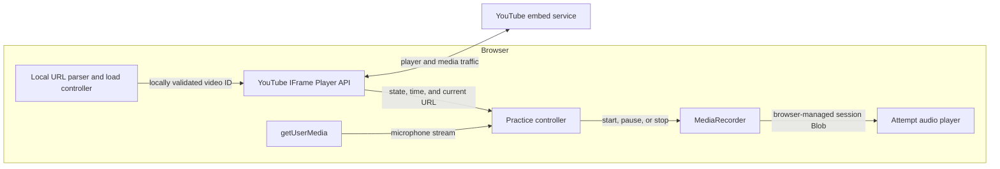

# Shadowing Recorder Technical Design

Status: Draft  
Last updated: 2026-07-12

## Related documents

- [MVP requirements](../requirements/shadowing-recorder-mvp.md)
- [YouTube embed and privacy rules](../rules/youtube-compliance-and-privacy.md)
- [MVP implementation plan](../plans/shadowing-recorder-mvp-implementation.md)

This document defines the browser runtime design for the MVP: controller ownership, recording behavior, lifecycle safety, local video-load transactions, playback interlocks, and error recovery. Product scope and acceptance remain in the MVP requirements.

## Practice Mode

The application must not record every time any YouTube video is played. Recording is allowed only while Practice Mode is explicitly armed for the currently selected and locally validated `expectedVideoId`.

### Controller states

The controller uses explicit states rather than independent booleans:

| Controller state | Meaning |
| --- | --- |
| `disabled` | No microphone request is pending and no microphone track is live. |
| `requestingMic` | `getUserMedia()` is pending. Player events may be observed, but no recording may start. |
| `armed` | A microphone stream is live, the expected player identity is valid, and no attempt is being captured. |
| `recording` | The active attempt's recorder is gathering microphone data. |
| `buffering` | The same attempt remains open, but its recorder is paused and gathering no data. |
| `finalising` | `MediaRecorder.stop()` has been requested and the controller is awaiting the final `dataavailable` and `stop` events, bounded by a five-second watchdog. No new recorder may start yet. |

Player, permission, recorder, page-lifecycle, and UI actions must be reduced through one serial controller queue. A `sessionGeneration` is incremented whenever Practice Mode is enabled, cancelled, disabled, or bound to a replacement player. A late permission result or recorder callback may change current controller state only when its captured generation still matches.

Each recording uses an attempt-scoped draft containing its own `MediaRecorder`, chunk array, byte count, expected video ID, timing samples, finalisation reason, and completion promise. Event handlers close over that draft; chunks from an old recorder must never be appended to a newer attempt.

Permission callbacks remain bound to the generation in which they started. Recorder data and `stop` handlers remain bound to their draft; once finalisation begins they validate `draft.finaliseGeneration`, which `requestFinalise()` assigns or rebinds to the one permitted closing generation. This lets an intentional disable finish the old draft without allowing it to re-arm or mutate a later session.

### Timer and asynchronous-operation ownership

Every timer or polling loop must be owned by the operation that created it:

- An attempt draft owns its buffering timeout, heartbeat, timing sampler, duration-limit timer, and finalisation watchdog.
- An attempt-playback request owns its pause-confirmation polling interval and two-second timeout under a `playbackRequestToken`.
- A video-load transaction owns player construction and readiness callbacks under a `loadGeneration`.

Every callback captures its owner ID, relevant generation, expected video ID, and expected controller/player state. Before acting, it must verify all of those values still match the current owner and state and, when the callback will control the player, freshly confirm that `player.getVideoUrl()` still resolves to the captured ID. A failed guard is a no-op even if `clearTimeout()` or `clearInterval()` previously raced with an already-queued callback.

On `PAUSED`, `ENDED`, finalisation, identity change, disable, player error, recorder error, resource-limit shutdown, page hiding, or page exit, call one idempotent draft-cleanup function that clears the buffering, heartbeat, timing-sampling, and duration timers. Clear the buffering timer on every transition out of `buffering`, not only on `PLAYING`. Finalisation then creates only its own scoped watchdog, which is cleared by successful `stop` handling or by the fail-safe. Page-exit teardown is the exception: it clears an existing watchdog as well as every other timer because no callback may survive into a restored page.

Similarly, clear pause-confirmation timers when playback starts, fails, is superseded, Practice Mode is disabled, the player is replaced, or the page exits. Ignore or destroy player callbacks whose load generation has been superseded. Timer cleanup and callback guards are both required.

### Enabling

Enabling Practice Mode must:

1. Verify that consent is current, the player is ready, and its current video ID equals the locally validated `expectedVideoId`.
2. Require headphone confirmation.
3. Enter `requestingMic` and request microphone access.
4. If the request is cancelled, Practice Mode is disabled, or the video identity changes before permission resolves, immediately stop every track in the returned stream and remain disabled.
5. Otherwise retain the stream, show the microphone-active indicator, and enter `armed`.
6. Immediately reconcile `player.getVideoUrl()` and `player.getPlayerState()` after permission resolves. If the expected video is already `PLAYING`, start an attempt at the current player time. Do not wait for another `PLAYING` event; none is guaranteed.

Playback that starts while the permission prompt is open is captured only from the post-permission reconciliation point. The UI must not imply that earlier audio was recorded.

### Disabling

Disabling Practice Mode must:

1. Invalidate a pending microphone request by advancing `sessionGeneration`.
2. Cancel and clear pending timers and asynchronous UI intent for the old generation.
3. If an attempt is active, enter `finalising`, request finalisation once under the new closing generation, and wait for that attempt's `stop` event or the finalisation watchdog.
4. Save the result if and only if finalisation completed successfully and the Blob has a non-zero size within the resource limits. An empty result is discarded with a visible explanation.
5. Stop every microphone track after successful finalisation or immediately on fail-safe, then enter `disabled` and remove the microphone-active indicator.
6. Ignore later player events until Practice Mode is enabled again.

`Enable Practice Mode` remains unavailable while a disable operation is `finalising`, for at most the five-second watchdog interval. On page exit, microphone tracks are stopped immediately after requesting recorder shutdown because the page may not remain alive long enough to receive `stop`.

The interface must never imply that the microphone is off while a media track remains active.

### Finalisation fail-safe

Start a five-second watchdog whenever `MediaRecorder.stop()` is called. The watchdog captures the active draft ID, closing `sessionGeneration`, and expected `finalising` state. A successful `stop` handler clears it before assembling the Blob. If `sessionGeneration` advances while the same draft is already finalising, rebind its watchdog to the new closing generation without extending the original five-second deadline.

If the watchdog fires while its guards still match, or if `MediaRecorder.onerror` or an unexpected microphone-track `ended` event occurs, route all three through one idempotent, session-scoped `failRecording(reason)` path:

1. If a current nonterminal draft exists, mark it terminal and failed and settle or create-and-settle its completion promise so no caller remains blocked. Clear every draft and playback timer even when the track ends while merely `armed`.
2. Advance `sessionGeneration` to invalidate queued callbacks and pending reconciliation.
3. Stop every microphone track immediately and retain the microphone-active indicator until the tracks have actually ended.
4. Discard the incomplete draft and its chunks; do not expose it as a playable attempt.
5. Enter `disabled`, prevent automatic restart, and show a specific finalisation, recorder, or microphone-disconnection error.

Recorder events that arrive after this path must fail their draft/generation guard and do nothing. Before any expected application-initiated track shutdown—successful disable, page-lifecycle teardown, or other normal cleanup—mark that shutdown as intentional before calling `track.stop()` so its resulting `ended` event does not invoke the fail-safe.

After fail-safe track shutdown completes, the controller remains `disabled` rather than stuck in `finalising`; the learner may explicitly start a fresh Practice Mode session.

## Recording semantics

The normal-case rule is:

> One continuous, playable prerecorded YouTube `PLAYING` to `PAUSED` or `ENDED` interval, excluding buffering time, equals one learner attempt.

| YouTube state | Application behaviour when Practice Mode is enabled |
| --- | --- |
| Unstarted or cued | Do nothing when armed. If an attempt is active, finalise it as `unexpectedPlayerState` and mark its timing uncertain. |
| Playing | First verify the current video ID. Stop learner-attempt playback, then start a new recorder from `armed` or resume the paused recorder from `buffering`. If `finalising`, remember that reconciliation is needed after finalisation. |
| Paused | Stop and asynchronously finalise the active attempt. |
| Ended | Stop and asynchronously finalise the active attempt. |
| Buffering | If recording, call `MediaRecorder.pause()` and enter `buffering`; keep the attempt open without collecting stalled time. |
| Player error | Finalise the active attempt, disable Practice Mode, stop microphone tracks, and show the mapped error. |

There is no amplitude-based or pedagogical definition of "meaningful audio" in the MVP. Always save a completed, within-limit Blob whose `size > 0`, even when it is very short. Discard a zero-byte Blob and explain that the browser produced no recording.

### Buffering and page lifecycle

On `BUFFERING`, clear the draft's recording heartbeat and timing sampler, suspend its active-duration timer while preserving the remaining duration, pause the recorder immediately, and start `draft.bufferingTimer` with the current draft ID, `sessionGeneration`, and expected `buffering` state. On `PLAYING`, verify video identity, clear that timer, call `resume()` on the same recorder, and restart the recording-only timers with the remaining duration. On `PAUSED`, `ENDED`, or any other exit from buffering, clear the buffering timer before finalising or transitioning. If the guarded callback still matches after 30 seconds, pause YouTube, finalise with reason `bufferingTimeout`, and show a warning; a later play action creates a new attempt.

When `document.visibilityState` becomes `hidden`, call `MediaRecorder.pause()` first if the active recorder is gathering data, ask the YouTube player to pause, and request finalisation with reason `pageHidden` and target `disabled`. Immediately mark track shutdown intentional and stop all microphone tracks so timer throttling cannot prolong microphone access; retain the indicator until the tracks have ended. Save the draft only if its final events arrive within the watchdog, otherwise discard it through the fail-safe. If no attempt is active, proceed directly to track shutdown and `disabled`. On `pagehide` or `freeze`, advance the session and load generations, clear every draft, playback, load, and watchdog timer, mark track shutdown intentional, request recorder shutdown, stop microphone tracks immediately, and leave the controller disabled. Treat an unfinished draft as discarded; no timer or callback from it may act if the page is restored from a lifecycle cache.

Maintain an attempt-scoped one-second controller heartbeat only while that draft is recording. Each callback verifies the draft, generation, and `recording` state. Clear it before leaving that state. If a valid callback observes a heartbeat gap greater than five seconds without a handled visibility transition, pause YouTube, finalise with reason `suspensionUncertain`, mark timing uncertain, and disable Practice Mode. Returning to the page never silently resumes microphone capture; the learner must enable Practice Mode again.

### Resource ceilings

The public MVP uses fixed upper bounds:

- Maximum active recorded duration per attempt: 5 minutes. Buffering time, when the recorder is paused, does not count.
- Maximum encoded size per attempt: 10 MiB.
- Maximum encoded learner audio retained across completed, active, and finalising attempts: 50 MiB.
- Recorder chunk interval: approximately 1 second, using `MediaRecorder.start(1000)`, so duration and byte limits can be checked incrementally.

When an attempt reaches either per-attempt limit, pause YouTube, finalise it with reason `attemptLimit`, retain it if it fits, and warn the learner. When the total limit is reached, pause YouTube, finalise the current attempt, and block further recording until enough completed attempts are deleted. Blob sizes and all in-flight chunk sizes count toward the total. If the final recorder event would make the attempt or total exceed a hard byte ceiling, discard that entire in-progress attempt rather than retain a partial or over-limit recording; preserve prior completed attempts and explain what happened.

These are encoded-audio product safety limits, not guarantees about RAM use, temporary-disk use, codec overhead, or browser cleanup. Browser or encoder failure may occur below them and follows the same finalise, stop-tracks, and visible-error path.

### Timing labels

At recording start, store `player.getCurrentTime()` as the video start time. At the first finalisation request, store the then-current value as the video end time. Do not overwrite that boundary in a later asynchronous callback.

These values are approximate labels, not synchronisation guarantees. YouTube buffering, keyframe-based seeking, ads, and event-delivery latency can make the labels differ slightly from what the learner heard.

The supported timing case is a playable prerecorded video played without an advertisement, seek, video change, page suspension, or player error. Even in that case the UI labels the range `Approx. mm:ss–mm:ss`.

Each attempt has a `timingStatus`:

- `contiguous`: sampled player time progressed continuously; this observational label does not assert that no undetectable advertisement occurred, and the range is still approximate.
- `discontinuous`: sampling detected a backward seek, a large forward jump, or an end time earlier than the start time. Display `Multiple video sections` rather than a misleading range.
- `uncertain`: player time or identity could not be read reliably, execution was suspended, an unexpected state occurred, or runtime behaviour may have involved content the API cannot classify.

Store machine-readable `timingFlags` such as `backwardSeek`, `forwardSeek`, `endBeforeStart`, `playerTimeUnavailable`, `unexpectedState`, `pageHidden`, `pageSuspended`, or `identityChanged`. The IFrame API exposes no ad-specific state, so the application must not claim that it can always detect advertisements. Ad-inclusive attempts are outside the timing acceptance case and may remain only approximately or uncertainly labelled.

### Seeking while recording

The native player must remain usable. Sample player time against monotonic wall time approximately twice per second while the selected content is `PLAYING`, using `getPlaybackRate()` for the expected media-time delta. Reset the comparison baseline after buffering or a playback-rate change. Treat a backward media-time movement greater than 0.5 seconds as `backwardSeek`, and a difference greater than 2 seconds between actual and expected forward media-time movement as `forwardSeek`. Flag the attempt rather than splitting it. If the learner seeks while recording, a single attempt may cover non-contiguous parts of the video. For the MVP:

- Keep the recording valid.
- Set `timingStatus` to `discontinuous` and record the applicable timing flag.
- Do not display a simple start–end range when the end precedes the start.
- Do not claim that every moment between its start and end was played.

A later version may split the attempt automatically.

## Static browser architecture



There is no runtime application server and no YouTube Data API request. The
browser sends player traffic directly to YouTube. No learner-selected URL,
player event, microphone data, recording, diagnostic, or consent state is sent
to the app operator.

Vite emits the static production artifact in `apps/web/dist`. Cloudflare Workers
Static Assets serves that directory at
`https://shadowing-recorder.htag.uk` without a Worker script. Wrangler owns the
custom-domain route and SPA fallback; `_headers` owns security, Referer,
no-index, and fingerprinted-asset cache policy. `workers.dev`, preview URLs,
Workers observability, Cloudflare Web Analytics, bindings, variables, and
secrets remain disabled. Unknown navigation paths receive the SPA shell, then
React Router renders the application 404; no health or application API route is
part of the runtime.

### Uniform privacy behaviour

The app does not classify Made for Kids, live, embeddability, category,
suitability, or audience metadata. It applies the same no-tracking and
no-operator-collection behaviour to every selected video. The audience,
third-party embed, and policy boundaries are defined in the
[YouTube embed and privacy rules](../rules/youtube-compliance-and-privacy.md).

### Load transaction ownership

Every `Load video` submission starts a new load transaction, even if the candidate URL is invalid or repeats the previous ID:

1. Increment `loadGeneration` and parse the submitted URL locally. Record
   `latestCandidateId` as the validated ID or `null` for an invalid submission.
2. Finalise any active attempt, disable Practice Mode, stop microphone tracks,
   and destroy the preceding player before adopting a new candidate.
3. If parsing fails, report the local validation error and create no iframe.
4. Assign `expectedVideoId` only when the candidate ID is valid, then construct
   the privacy-enhanced player while capturing that ID and `loadGeneration`.
5. Every readiness, state, and error callback verifies that its captured
   generation and video ID still match. A stale player is destroyed and its
   callback performs no other side effect.
6. On readiness, parse `player.getVideoUrl()` and require it to resolve to
   `expectedVideoId` before exposing Practice Mode.

For example, if URL A is submitted and URL B supersedes it before A's player
becomes ready, A's late callback destroys A and only B may update the UI or
become `expectedVideoId`.

### YouTube player

Use the official [YouTube IFrame Player API](https://developers.google.com/youtube/iframe_api_reference) so the parent application can observe playback state and read the current time.

Recommended configuration:

- `enablejsapi=1` to enable JavaScript control.
- `origin=https://shadowing-recorder.htag.uk` in production to identify the embedding application; derive it from the current application origin so explicitly approved non-production environments identify themselves accurately.
- `controls=1` to preserve the native player controls.
- `playsinline=1` for inline playback on supported mobile browsers.
- `autoplay=0`; the learner initiates playback.
- Optional `cc_load_policy=1` to prefer visible captions when the video provides them.

Create the player only from a locally validated candidate ID and bind that ID as the player instance's immutable `expectedVideoId`. Register documented callbacks such as `onReady`, `onStateChange`, and `onError`; do not assume a video-change callback exists.

The deployed page must send an HTTP `Referer` header or equivalent API Client identity to YouTube. Do not use `Referrer-Policy: no-referrer` or an iframe `referrerpolicy` that suppresses identity; the deployment and iframe both use `strict-origin-when-cross-origin`. In production, keep `origin` exactly aligned with the canonical `https://shadowing-recorder.htag.uk` origin. Treat IFrame error `153` as a deployment/configuration failure and explain that the player request lacked required client identification.

The player remains visible and interactive. The application must not cover or interfere with YouTube branding, controls, advertisements, or required functionality.

### Microphone and recording

Use:

- `navigator.mediaDevices.getUserMedia()` with echo cancellation, noise suppression, and automatic gain control explicitly requested off for microphone access.
- An attempt-scoped `MediaRecorder` started with an approximately one-second `timeslice` to produce bounded chunks.
- `dataavailable` to append non-empty chunks to that attempt draft and update byte accounting.
- A `Blob` assembled only after the final `dataavailable` has been followed by the recorder's `stop` event.
- `URL.createObjectURL(blob)` as the source of an attempt's audio player.
- `URL.revokeObjectURL()` when an attempt is deleted or the page is unloaded.

Microphone access requires a secure browser context, normally HTTPS or localhost.

Do not hard-code one output MIME type. Use `MediaRecorder.isTypeSupported()` to select a supported format or allow the browser to choose its default. Chrome, Firefox, and Safari may produce different containers and codecs.

### Microphone constraints

Headphones are a prerequisite, so the application requests capture without voice-call processing:

```js
{
  audio: {
    echoCancellation: false,
    noiseSuppression: false,
    autoGainControl: false
  }
}
```

This avoids Chrome echo-cancellation artifacts observed when the learner speaks while audible reference speech is playing; the same capture was clean when Chrome playback was muted and in Safari on the same Mac. Browsers may ignore optional constraints, so read the accepted audio track's `getSettings()` values and expose the non-identifying processing, sample-rate, and channel settings in diagnostics. Do not expose device or group identifiers. Headphones remain the primary protection against reference-audio leakage; without them, unprocessed capture may include the YouTube audio.

## Event flow

The IFrame Player API does not expose `onVideoChanged`. Detect identity drift by parsing the video ID from `player.getVideoUrl()` and comparing it with the immutable `expectedVideoId`:

- in `onReady`;
- at the start of every `onStateChange` reconciliation;
- immediately after microphone permission resolves;
- immediately before a new attempt starts or a buffered attempt resumes; and
- before acting on an attempt-playback request.

If the current ID is missing or differs, immediately stop learner-attempt playback, ask the player to stop, mark the active attempt `uncertain` with `identityChanged`, and finalise it. Disable Practice Mode, stop microphone tracks after finalisation, and remove or destroy the mismatched iframe. Existing attempts remain in the list under their original video IDs. Never silently adopt the new ID: the learner must submit it through the local URL-validation and player-replacement flow.

Illustrative serialized controller logic:

```text
enablePracticeMode:
    generation = advanceSessionGeneration()
    state = requestingMic
    stream = await getUserMedia()
    if generation is stale or mode was cancelled:
        stop all tracks in stream
        return
    retain stream and show microphone indicator
    state = armed
    reconcilePlayerNow()  // identity + getPlayerState; event may not recur

reconcilePlayerNow:
    if current video ID != expectedVideoId:
        failClosedForIdentityChange()
        return

    if player state is PLAYING:
        stop and reset any attempt audio element
        if controller state is buffering:
            clear activeDraft.bufferingTimer
            activeDraft.recorder.resume()
            state = recording
            restart guarded recording-only timers with remaining duration
        else if controller state is armed:
            if retained-audio capacity is exhausted:
                player.pauseVideo()
                show storage-limit warning
                return
            draft = createAttemptScopedDraft(expectedVideoId, generation)
            draft.videoStartSeconds = player.getCurrentTime()
            draft.recorder.start(1000)
            state = recording
            start guarded heartbeat, sampling, and duration timers
        else if controller state is finalising:
            pendingReconcile = true

    else if player state is BUFFERING and state is recording:
        clear heartbeat, sampling, and active-duration timers; save remaining duration
        activeDraft.recorder.pause()
        state = buffering
        start guarded activeDraft.bufferingTimer

    else if player state is PAUSED or ENDED and activeDraft exists:
        requestFinalise(activeDraft, player state)

requestFinalise(draft, reason, targetAfterFinalise = armed,
                finaliseGeneration = sessionGeneration):
    if draft has an existing finalisePromise:
        update targetAfterFinalise
        rebind watchdog to finaliseGeneration without extending deadline
        return that promise
    clear draft buffering, heartbeat, sampling, and duration timers
    capture videoEndSeconds and finalisation reason once
    state = finalising
    draft.finaliseGeneration = finaliseGeneration
    draft.finaliseDeadline = now + 5 seconds
    create draft.finalisePromise
    start guarded draft.finalisationWatchdog
    call draft.recorder.stop() once
    on each dataavailable, append only to draft and update its byte count
    on stop, if draft/finaliseGeneration/state guards match:
        clear draft.finalisationWatchdog
        assemble and validate draft's Blob, then resolve the promise
    after resolution, release draft recorder and chunk references
    clear activeDraft if it still points to draft
    if targetAfterFinalise is armed and Practice Mode still belongs to draft.finaliseGeneration:
        state = armed
        if pendingReconcile:
            pendingReconcile = false
            reconcilePlayerNow()  // uses fresh identity and player state

onMediaRecorderError or unexpectedMicrophoneTrackEnded:
    if shutdown is intentional or event ownership/generation is stale:
        return
    failRecording(activeDraft, specific reason)

onFinalisationWatchdog:
    if draft ID, finaliseGeneration, and finalising state still match:
        failRecording(draft, finalisationTimeout)

failRecording(optionalDraft, reason):
    if failure was already handled for this session:
        return
    mark session failure handled
    if optionalDraft is present and nonterminal:
        mark it failed and discard its chunks
    clear all draft/playback timers
    settle any finalisePromise and advanceSessionGeneration()
    stop all microphone tracks immediately
    disable Practice Mode
    show specific error

disablePracticeMode:
    closingGeneration = advanceSessionGeneration()
    cancel pending permission or new-recording intent
    clear old-generation draft and playback timers
    await requestFinalise(activeDraft, practiceDisabled, disabled,
                          closingGeneration), if any
    if finalisation failed:
        return  // failRecording already stopped tracks and disabled the mode
    mark microphone shutdown intentional
    stop all microphone tracks after successful finalisation
    state = disabled
```

Calling `MediaRecorder.stop()` is only the request boundary. The final `dataavailable` and `stop` events occur asynchronously, in that order. A rapid pause/play therefore queues a fresh reconciliation; it never reuses a recorder being finalised. If play has resumed by the time finalisation completes, a new attempt starts from the then-current player time. This may leave a small, honestly unrecorded gap, but it preserves the play-to-pause attempt boundary and prevents chunk mixing. The watchdog guarantees that neither the controller nor a live microphone stream can remain stuck in `finalising` indefinitely.

## URL handling

Never place unvalidated user input directly into iframe HTML.

Use the platform URL parser and accept only recognised YouTube hosts and path shapes. Initial syntax support can cover:

- `https://www.youtube.com/watch?v=<video-id>`
- `https://youtu.be/<video-id>`
- `https://www.youtube.com/shorts/<video-id>`
- `https://www.youtube.com/embed/<video-id>`

Extract and validate only the candidate video ID. Never interpolate the original user input into iframe HTML. A URL parser cannot determine whether an ordinary `/watch?v=` URL points to a live broadcast, a Made for Kids video, or an embeddable video, and this application deliberately does not query that metadata.

Accept the source URL only through the page's input and start parsing when the
learner explicitly selects `Load video`. Hold the validated candidate ID in
session-local controller state. Do not copy the source URL or video ID into the
application URL path, query, or fragment, and do not mutate browser history when
loading or replacing a video.

Reject during local parsing:

- Non-YouTube hosts.
- Malformed or missing video IDs.
- Playlist-only URLs.
- Channel and search-result URLs.

After parsing, enter `Loading video` and create the `youtube-nocookie.com` player from the validated candidate ID. Apply the same no-tracking and no-operator-collection behaviour to all candidates. YouTube remains authoritative for playability and reports invalid, unavailable, private, restricted, or embedding-disabled content through the player.

When the learner submits a different URL while Practice Mode is active, first finalise the active attempt and disable Practice Mode. Keep completed attempts labelled with their original video ID. Destroy the old player before constructing the replacement. If local parsing fails or the new player reports an error, leave Practice Mode disabled and allow another URL submission.

Player creation can fail because of availability, privacy, region, age, embedding, or client-identification conditions. The UI should distinguish `invalid URL`, `unsupported URL`, `video unavailable`, and deployment error where the IFrame error code permits it. Errors must never leave Practice Mode or a microphone stream active.

## Attempt data

The initial attempt representation remains in browser-managed, session-scoped local application state:

```json
{
  "id": "attempt_123",
  "videoId": "M7lc1UVf-VE",
  "videoStartSeconds": 102.4,
  "videoEndSeconds": 117.1,
  "recordingDurationMilliseconds": 14830,
  "timingStatus": "contiguous",
  "timingFlags": [],
  "finaliseReason": "paused",
  "audioMimeType": "audio/webm;codecs=opus",
  "audioByteLength": 241706,
  "audioBlobUrl": "blob:https://example.test/...",
  "createdAt": "2026-07-11T08:00:00Z"
}
```

`recordingDurationMilliseconds` measures gathered microphone time and excludes periods in which the recorder was paused for buffering. `videoEndSeconds` may be earlier than `videoStartSeconds`; the `timingStatus` and flags determine how the UI presents that case.

Blob URLs are session-local capabilities and should not be persisted as durable identifiers. The browser may back a Blob with memory or temporary on-disk storage; the application must not claim or depend on either representation. `audioByteLength` is included in total-retained-audio accounting. Durable IndexedDB storage or upload is a future feature requiring explicit consent and retention design.

## Playback rules

- The controller, not an assumption about the UI, enforces one app-selected audible/captured source at a time.
- On an attempt-playback request, call `player.pauseVideo()` whenever YouTube is `PLAYING` or `BUFFERING`, request finalisation of any active attempt, and wait for both a confirmed non-playing player state and recorder finalisation. Because `pauseVideo()` is not Promise-based, confirm through `onStateChange` or bounded polling of `getPlayerState()`; if pause cannot be confirmed within two seconds, do not play the attempt and show an error.
- Give that wait a new `playbackRequestToken`. Every poll verifies the token, `sessionGeneration`, expected video ID, requested attempt ID, and expected player/controller state. Clear its interval and timeout on success, failure, supersession, disable, identity change, player replacement, or page exit.
- After that wait, recheck video identity, stop and reset any other learner-audio element, then play the selected attempt. A second playback request supersedes the first pending request.
- On a YouTube `PLAYING` transition, stop and reset learner-attempt audio before starting or resuming the microphone recorder. Thus prior learner audio cannot be re-recorded into a new attempt. Native-IFrame event latency may permit a brief audible overlap after the learner independently presses YouTube Play, but the recorder must not start until learner audio is stopped.
- Attempt playback never starts a microphone recording by itself. Practice Mode may remain `armed` with a live microphone stream while the recorder is inactive and YouTube is paused.
- Only one learner attempt playback may be active, and it is mutually exclusive with an active learner recording.
- Deleting an attempt stops its playback and revokes its Blob URL.
- Changing videos retains completed attempts under their original `videoId`; it must not silently associate them with the new video.
- Refreshing or closing the page drops the application's attempt references and Blob URLs in the MVP. It does not promise immediate physical erasure of browser-managed temporary backing storage.

## Error handling

Handle at least:

- Invalid URL.
- Unsupported YouTube URL form.
- Unavailable, private, restricted, or embedding-disabled video as reported by the IFrame Player API.
- YouTube player API failed to load.
- IFrame API errors `2`, `5`, `100`, `101`, `150`, and `153`; explain `153` as missing Referer/equivalent client identity and treat it as a deployment defect.
- Current player video ID missing or different from `expectedVideoId`.
- Microphone permission denied.
- No microphone device.
- Microphone disconnected during recording.
- Browser does not support `MediaRecorder`.
- Recording could not be encoded.
- Recorder finalisation exceeded the five-second watchdog.
- `MediaRecorder.onerror` or an unexpected microphone-track `ended` event.
- Recorder returned an empty Blob.
- Attempt or total retained-audio limit reached.
- YouTube pause could not be confirmed before attempt playback.
- Page hidden, suspended, or closed while recording.

Errors should never leave the microphone running invisibly, create an iframe from unvalidated input, mix attempt chunks, or play learner audio over active YouTube playback. Recovery should preserve already completed attempts whenever practical. Fatal player, identity, recorder, and page-lifecycle errors finalise when possible, stop all microphone tracks, and leave Practice Mode disabled.

## Technical references

- [YouTube IFrame Player API reference](https://developers.google.com/youtube/iframe_api_reference)
- [YouTube embedded-player parameters](https://developers.google.com/youtube/player_parameters)
- [MediaDevices.getUserMedia on MDN](https://developer.mozilla.org/en-US/docs/Web/API/MediaDevices/getUserMedia)
- [MediaRecorder on MDN](https://developer.mozilla.org/en-US/docs/Web/API/MediaRecorder)
- [MediaStream Recording specification](https://www.w3.org/TR/mediastream-recording/)
