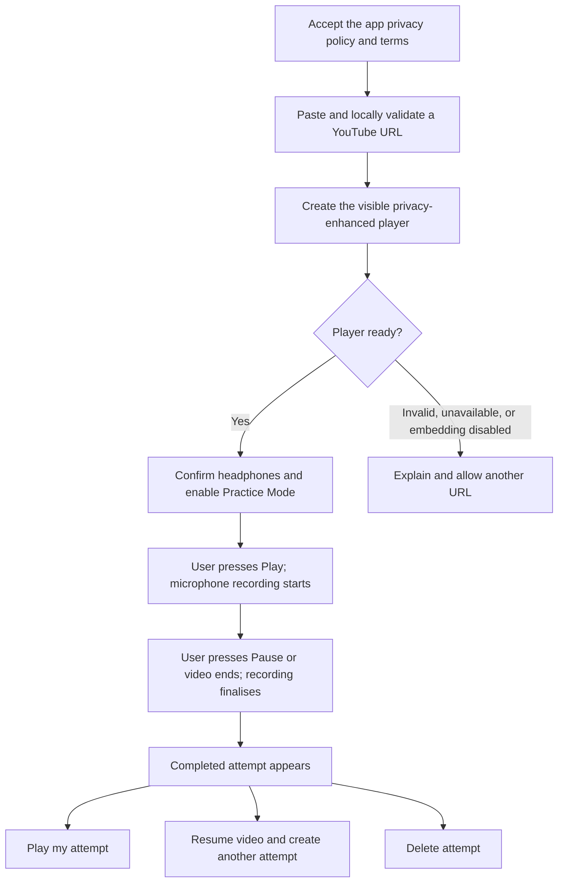

# Shadowing Recorder MVP Requirements

Player-driven recording and pre-arming requirements in this document refer to
the default **Shadowing** style. **Listen first** is an additional style with
explicit recording while the reference is paused; shared safety and privacy
requirements continue to apply.

Status: Draft  
Last updated: 2026-07-12

## Related documents

- [Technical design](../design/shadowing-recorder-technical-design.md)
- [YouTube embed and privacy rules](../rules/youtube-compliance-and-privacy.md)
- [MVP implementation plan](../plans/shadowing-recorder-mvp-implementation.md)
- [TTS shadowing and prosody-feedback concept](../ideation/prosody-shadowing-design.md)

This document is the product-level entry point and owns MVP scope and acceptance. The technical design owns runtime behavior and failure handling. The compliance and privacy rules own public-launch constraints. The implementation plan owns delivery sequence.

## Summary

Shadowing Recorder lets a learner paste a YouTube URL, control the embedded video's normal play and pause controls, and record themselves shadowing what they hear. It is designed as a public MVP, not merely as a private prototype. Descriptive copy may say that it works with YouTube, but `YouTube`, `YT`, or a variant must not form part of the product, domain, feature, or company name.

While Practice Mode is enabled:

- YouTube playback starts microphone recording.
- Pausing or ending the video stops and asynchronously finalises the recording.
- The learner can immediately play back or delete the completed attempt.
- In the normal no-error case, each continuous play-to-pause interval becomes one attempt.

Headphones are a prerequisite so that the microphone captures the learner rather than the YouTube audio. Learner audio remains in browser-managed, session-scoped local storage; the application does not upload or intentionally persist it. The product is a general-audience utility and is not designed, marketed, or presented as child-directed or child-oriented. It has no analytics, advertising trackers, telemetry, accounts, YouTube Data API integration, or application backend that receives learner activity. The MVP otherwise requires no TTS, speech recognition, feedback model, account, or upload service.

## User story

As an English learner, I want to paste a YouTube video, shadow a section using the normal YouTube controls, and listen to my own voice afterward so I can notice differences myself.

## Core interaction



Recording follows the YouTube player's state and its native controls remain usable. The application pauses playback only for an explicit attempt-playback request or a safety, lifecycle, identity, or resource-limit condition defined in the [technical design](../design/shadowing-recorder-technical-design.md).

## Scope

### Included in the MVP

- Paste and validate a single YouTube video URL.
- Require acceptance of the app privacy policy and terms before using URL-loading or practice features.
- Load a locally validated video ID directly in YouTube's privacy-enhanced embedded player.
- Display a visible embedded YouTube player with its native controls.
- Explicit headphone confirmation.
- Explicit microphone permission and Practice Mode.
- Automatic microphone recording while the player is playing.
- Automatic recording finalisation when the player is paused or ends.
- Playback and deletion of recorded attempts.
- Approximate YouTube timestamps plus explicit contiguous, discontinuous, or uncertain timing status.
- Clear player, microphone, recording, and error states.
- Bounded, browser-managed, session-scoped local recording that is not uploaded or intentionally persisted.
- No first-party tracking, analytics, advertising telemetry, or operator-side collection of URLs, playback activity, microphone audio, recordings, diagnostics, or consent state.
- Static deployment with no YouTube Data API credential or runtime application backend.

### Not included in the MVP

- System-generated pronunciation or prosody feedback.
- TTS reference generation.
- Speech recognition or transcription.
- Automatic subtitle extraction.
- YouTube audio capture, extraction, downloading, or mixing.
- Precise reference/learner waveform synchronisation.
- User accounts, cloud storage, sharing, or cross-device history.
- Playlist, live-stream-specific, or multi-video exercise workflows. A URL that resolves to live content may load, but no live-stream recording or timing guarantee applies.
- YouTube Data API metadata lookup or preclassification of Made for Kids, live, embeddability, category, suitability, or audience status.
- First-party analytics, advertising trackers, telemetry, or server-side activity logging.
- Automatic trimming or noise removal.
- Attempt renaming or notes.
- A child-directed product experience; that requires a separate product, consent, and legal design.

## User interface

```text
+----------------------------------------------------------------+
| Shadowing Recorder                                             |
|                                                                 |
| [ ] I agree to the Privacy Policy and Terms                     |
|     YouTube Terms | Google Privacy Policy                       |
|                                                                 |
| [ Paste a YouTube URL                                      ]    |
|                                                     [Load video]|
|                                                                 |
| +------------------------------------------------------------+ |
| |                 Visible YouTube player                     | |
| |                 Native player controls                     | |
| +------------------------------------------------------------+ |
| [Official clickable attribution logo asset below player]       |
|                                                                 |
| [ ] I am using headphones                                      |
| [Enable Practice Mode]                                         |
|                                                                 |
| Status: Ready                                                   |
|                                                                 |
| My attempts                                                     |
| 1. Approx. 01:42-01:57   [Play] [Delete]                       |
| 2. Multiple sections     [Play] [Delete]                       |
+----------------------------------------------------------------+
```

### Required controls

- YouTube URL input.
- `Load video`.
- A first-use consent control with persistent links to the app privacy policy, app terms, YouTube Terms of Service, and Google Privacy Policy.
- A `Forget consent on this device` action that safely disables Practice Mode before deleting the local consent marker.
- A compliant attribution area as defined by the [YouTube embed and privacy rules](../rules/youtube-compliance-and-privacy.md).
- Headphone confirmation.
- `Enable Practice Mode` / `Disable Practice Mode`.
- Persistent state label: `Consent needed`, `No video`, `Loading video`, `Video unavailable`, `Video ready`, `Microphone needed`, `Requesting microphone`, `Ready`, `Recording`, `Buffering—recording paused`, `Finalising`, `Storage limit reached`, or `Error`.
- A prominent recording indicator and elapsed recording time.
- Retained-audio usage against the 50 MiB session limit.
- One audio player or play button per completed attempt.
- Delete action per attempt.
- Visible warnings when an attempt is automatically finalised or discarded because of a duration, memory, page-lifecycle, identity, or encoder condition.

### Optional convenience controls

- `Delete all attempts`.
- `Replay this video section`, for a `contiguous` attempt with a readable start timestamp.
- `Play my attempt automatically` as an opt-in preference.

Automatic learner-audio playback should not be the default. A user may pause the video merely to think, and browsers may block playback that is initiated indirectly by a click inside a cross-origin iframe.

## Known limitations

- Advertisements may trigger playback states and cannot reliably be distinguished from the selected video content; ad-inclusive timing is outside the acceptance guarantee.
- Buffering creates a brief recorder pause/resume boundary and a stall longer than 30 seconds ends the attempt.
- Player events and microphone recording do not begin at exactly the same instant.
- If the learner starts YouTube through its native controls while an attempt is playing, IFrame event latency can cause a brief audible overlap; learner audio is stopped before microphone recording begins.
- Native player seeking produces discontinuous timing; detection is tolerance-based and cannot reconstruct every played section.
- Some videos cannot be embedded or may later become unavailable.
- The app does not preflight video metadata. A player may be created before YouTube reports that a video is invalid, unavailable, private, restricted, or embedding-disabled.
- The IFrame API has no video-change event. Identity checks run at relevant transitions, and an internally navigated mismatched iframe is destroyed when detected.
- YouTube may edit its player, policies, APIs, or supported parameters.
- The IFrame API does not expose a video's transcript text.
- Captions may be unavailable, inaccurate, or in a different language.
- Starting microphone recording alongside media playback needs testing across mobile Safari, Chrome, Firefox, Android, and desktop browsers.
- A user may shadow music, advertisements, or non-speech content; the MVP does not classify what is playing.
- An in-progress session-scoped recording may be lost when a page is killed before asynchronous recorder finalisation completes.
- The resource ceilings intentionally stop long sessions and may require the learner to delete attempts before recording more.

These limitations are acceptable for self-guided listening and playback, but they would matter more if automatic timing or speech feedback were later introduced.

## MVP acceptance criteria

The MVP is complete only when all criteria below pass. Runtime terminology and behavior are defined by the [technical design](../design/shadowing-recorder-technical-design.md), and launch constraints are defined by the [YouTube embed and privacy rules](../rules/youtube-compliance-and-privacy.md).

### Embed and public-launch requirements

- The product and page header use `Shadowing Recorder`, not a name containing `YouTube`, `YT`, or a variant. A compliant official `Developed with YouTube` logo appears near the player area, visually separate from the product name, is not the most prominent element, and links to relevant YouTube content or functionality.
- Before URL processing, iframe creation, or practice, the user has accepted the current app privacy policy and terms; persistent links to those documents, YouTube Terms, and Google Privacy are visible.
- The product and privacy copy explicitly state that the app is general-audience and is not child-directed or child-oriented.
- A supported URL is locally reduced to a candidate video ID. Only that validated ID is used to construct the player; arbitrary input is never inserted into iframe HTML.
- Every player uses `youtube-nocookie.com`, native controls, and `autoplay=0`. The app applies identical no-tracking and no-operator-collection behaviour regardless of the selected video's metadata.
- The production bundle contains no YouTube Data API credential and makes no application request to classify or preapprove a selected video.
- In a rapid replacement test, submit A and then B and deliver A's player callback last; only B may set `expectedVideoId`, status, or the active player. A stale player is destroyed without affecting B.
- IFrame errors for invalid, unavailable, private, restricted, or embedding-disabled videos are explained and leave no active Practice Mode or microphone stream.
- The player retains native controls and required YouTube functionality. The production deployment supplies the configured `origin` and Referer/equivalent client identity; a simulated error `153` produces a configuration-specific message.

### Recording controller

- Nothing is recorded before local video-ID validation, player readiness, headphone confirmation, and explicit microphone permission.
- Enabling Practice Mode while YouTube is already `PLAYING`, or starting playback while the permission prompt is open, begins visible recording from the post-permission reconciliation point without requiring another `PLAYING` event.
- `requestingMic`, `standby`, `armed`, `recording`, `buffering`, and `finalising` are mutually exclusive controller states. Disabling during permission stops a late-returned stream; re-enable is unavailable during disable finalisation.
- After each successful pause/end finalisation while Practice Mode remains enabled, every track from that attempt's microphone stream is stopped and the controller enters mic-off `standby`. Starting learner playback releases a pre-armed stream. Pausing or ending learner playback may pre-arm a fresh stream while both sources are stopped; app-initiated reference playback waits for pre-arming before starting YouTube.
- Rapid pause/play, pause/play/pause, disable, video replacement, and recorder-error tests produce no mixed chunks, duplicate finalisation, stale state mutation, recorder reuse, or microphone-stream reuse between attempts. Playback that resumes during `finalising` or `standby` is reconciled after fresh microphone access and begins a new attempt if still applicable.
- After pause/end, finalisation, identity change, disable, error, page exit, or a new session, callbacks from old buffering, heartbeat, sampling, duration, finalisation-watchdog, pause-confirmation, and player-load operations perform no action. A stale buffering timer cannot pause or finalise a later attempt, and a stale pause-confirmation callback cannot start old learner audio.
- If `stop` never arrives, the five-second watchdog settles the pending finalisation, stops all microphone tracks, discards the failed draft, disables Practice Mode, and reports the error. Injected `MediaRecorder.onerror` and unexpected track `ended` cases use the same fail-safe; late recorder events cannot revive or save the failed draft, and a fresh explicit enable is available after track shutdown.
- Before each relevant transition and attempt start/resume, current video identity is compared with `expectedVideoId`. A mismatch requests finalisation, disables Practice Mode, stops microphone tracks, removes the mismatched iframe, and preserves prior attempts under their original IDs.
- In a controlled run using a playable prerecorded video with no advertisement, seek, identity change, suspension, or encoder error, `PLAYING` followed by `PAUSED` or `ENDED` produces one playable attempt whenever the recorder emits a non-empty Blob. A zero-byte result is discarded with a visible message, but it does not disable Practice Mode or replace the last playable attempt.
- `BUFFERING` pauses the recorder and gathers no buffered-period microphone data; returning to `PLAYING` resumes the same attempt. A 30-second stall finalises the attempt with a warning.
- Hiding the page finalises and disables Practice Mode; `pagehide`/`freeze` stops microphone tracks immediately; a detected suspension heartbeat gap marks the attempt uncertain and never silently resumes capture.
- At 5 minutes or 10 MiB, an attempt is automatically finalised and YouTube is paused. At 50 MiB retained across completed and in-flight data, new recording is blocked until deletion frees space. An over-limit final Blob is not retained.

### Playback and timing

- The user can play and delete every completed attempt.
- Requesting attempt playback while YouTube is active pauses YouTube, awaits recorder finalisation and a confirmed non-playing player state, then plays the attempt. If pause is not confirmed, learner audio does not start.
- A YouTube `PLAYING` event stops learner-attempt audio before microphone recording starts or resumes, preventing a prior attempt from being re-recorded.
- Every attempt stores the locally validated video ID. In the controlled no-ad/no-seek timing case, it displays an explicitly approximate start/end range.
- A detected backward or large forward seek sets `timingStatus: discontinuous`; an end earlier than the start never displays a simple range. Player-time, identity, unexpected-state, or suspension ambiguity sets `timingStatus: uncertain` with machine-readable flags.
- Acceptance tests do not assert universally correct ranges during advertisements because the IFrame API exposes no ad-specific state.

### Privacy and failure safety

- User-facing privacy copy says audio is browser-managed and session-scoped, is not uploaded or intentionally persisted, and may use memory or temporary browser storage. It says refresh/closure removes application access rather than promising immediate physical deletion.
- User-facing privacy copy states that Shadowing Recorder has no analytics, advertising tracking, telemetry, accounts, or operator-side collection of URLs, player activity, microphone audio, recordings, diagnostics, or consent state. It separately discloses direct browser-to-YouTube player traffic.
- The privacy policy discloses the versioned `localStorage` consent marker, including its `policyVersion` and `acceptedAt` fields, cross-session persistence, and `Forget consent on this device` deletion method, separately from session-scoped learner audio.
- Invoking `Forget consent on this device` advances the relevant generations, supersedes pending player loads, safely shuts down Practice Mode and microphone tracks, removes the marker, and blocks interactive features until consent is accepted again.
- Disabling Practice Mode, hiding or leaving the page, identity mismatch, and fatal player/recorder errors stop every microphone track; the indicator remains visible until tracks actually stop.
- No YouTube audio is downloaded, extracted, or programmatically captured.
- No learner recording, microphone chunk, selected URL, video ID, player event, diagnostic, or consent marker is sent to an application server.
- The selected video ID remains in session-local browser state and never appears in the application URL path, query, or fragment; privacy copy separately explains unavoidable static-host delivery metadata and any retained infrastructure logs.
- Permission denial, unavailable videos, unsupported recording, empty output, resource limits, and player/recorder errors are explained without an iframe constructed from unvalidated input, false recording state, invisible live microphone, app-initiated learner/YouTube overlap, or a recorder active while learner-attempt audio plays.


## Additional Listen first acceptance

- The learner can select Shadowing or Listen first. Changing styles finishes
  the current attempt, stops both playback sources, and leaves Practice Mode off.
- Listen first presents reference, record, and listen steps with one main action
  accessible by button, Space, or Right Arrow. Held keys and pending transitions
  cannot skip steps; other interactive controls keep native keyboard behavior.
- Reference and learner playback run with no microphone stream. Recording starts
  only after an explicit advance, confirmed reference pause, permission, and
  revalidated player identity. Every attempt uses a fresh microphone stream.
- Stop-and-listen waits for finalisation and plays only the newly completed
  attempt. Empty output preserves the previous result without playing it;
  rejected learner playback offers an explicit retry.
- Playback ending waits for input. Advancing after reflection replays the same
  approximate passage. New passage clears the range for a new selection.
- Disable, mode changes, replacement, hidden-page interruption, fatal errors,
  and stale callbacks preserve microphone cleanup and cancel pending playback.
- The feature adds no backend, telemetry, persistence, or learner-data request.

See [Listen first practice](../design/listen-first-practice.md) for the runtime
policy, timing limitations, and verification coverage.
