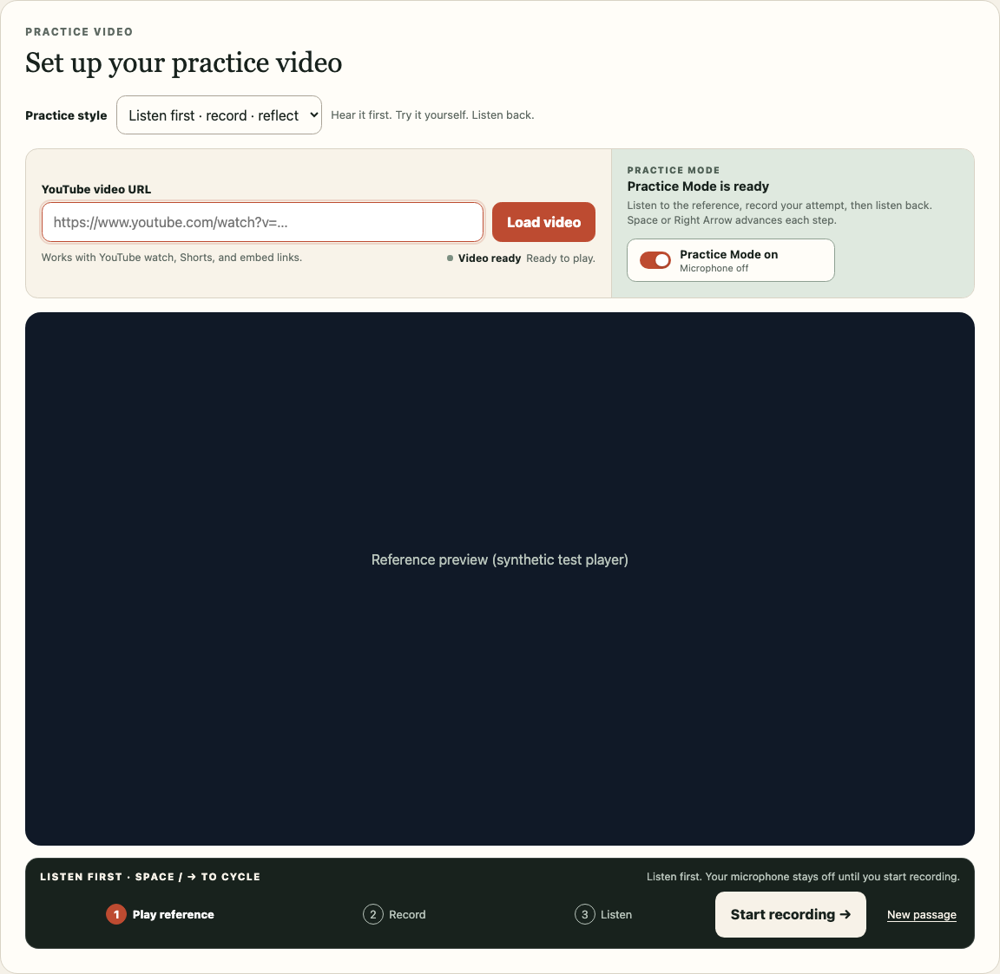
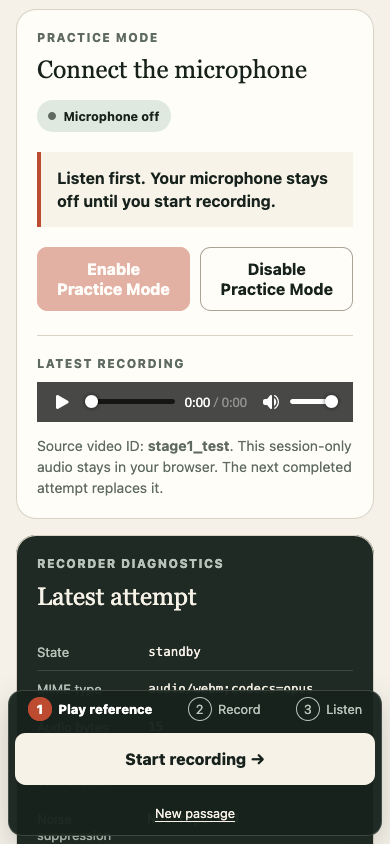

# Listen First Automated Verification

Date: 2026-09-05
Scope: additional Listen first style and shared comparison-dock scroll handling.

- `npm run check`: passed, including 106 Vitest tests, formatting, lint, strict
  types, production build, and Wrangler static deployment dry run with no bindings.
- `npm run test:e2e`: all 18 scenarios passed across Chromium, Firefox, and WebKit.
- Local final runs used Node.js 24.20.0 and the pinned npm 11.16.0. The repository
  remains pinned to Node.js 24.18.0; the exact pinned Node version was not used
  for this local verification.
- Desktop and 390 px mobile layouts were visually inspected. The mobile dock
  remains usable after a viewport resize and a scroll that skips the inline
  tray without crossing an intersection threshold.

The browser test intercepted YouTube and used synthetic recorder and learner
playback adapters. No real microphone, externally selected video, learner audio,
or production deployment was used. Physical-device and iOS Safari microphone,
codec, and playback verification remain pending; follow the
[local test procedure](../locally-hosted.md#listen-first-mode-check).

## UI evidence

The reference panel and attempt metadata shown here are synthetic test fixtures.

See the [Listen first design](../../design/listen-first-practice.md) for the
implemented phase policy and interruption semantics.
